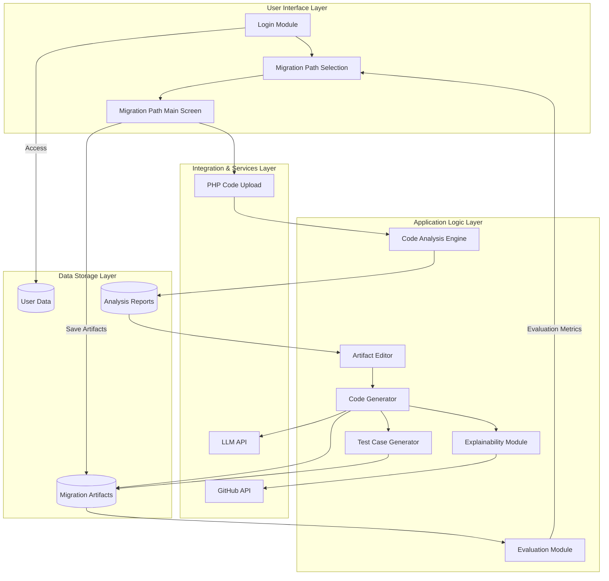

Here is a high-level system architecture diagram in Mermaid.js that addresses the requirements of the "mAIgration MastEr" project:

```markdown

```

### Explanation

- **User Interface Layer**: This layer includes the login module, migration path selection, and the main migration screen where users interact with the system.

- **Application Logic Layer**: 
  - **Code Analysis Engine**: Analyzes the uploaded PHP code to generate necessary artifacts.
  - **Artifact Editor**: Allows users to edit generated artifacts.
  - **Code Generator**: Uses LLM APIs to generate React code based on edited artifacts.
  - **Explainability Module**: Provides explanations for generated code.
  - **Test Case Generator**: Creates test case scripts for validating the migration.
  - **Evaluation Module**: Evaluates the migration process using various metrics.

- **Integration & Services Layer**: Facilitates integration with external services like LLM APIs for code generation and GitHub APIs for pushing artifacts.

- **Data Storage Layer**: 
  - **User Data**: Stores user-related information.
  - **Migration Artifacts**: Stores generated and edited artifacts.
  - **Analysis Reports**: Stores analysis reports generated by the Code Analysis Engine.

This architecture diagram provides a high-level overview of the system, illustrating how different components interact with each other and external systems.