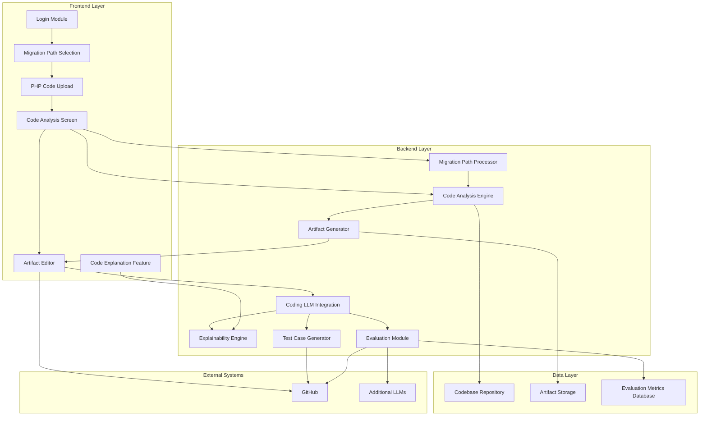

Below is a markdown file with a Mermaid.js flowchart TB diagram, showcasing the system components grouped by layer (Frontend, Backend, Data, External) with their relationships based on the given project requirements.

```markdown
# mAIgration MastEr Component Diagram


```

This diagram outlines the system components and their interactions. It depicts the flow from the Frontend user interactions to Backend processing and data management, alongside integration with external systems like GitHub and additional Language Learning Models (LLMs) for evaluation and explanation purposes.