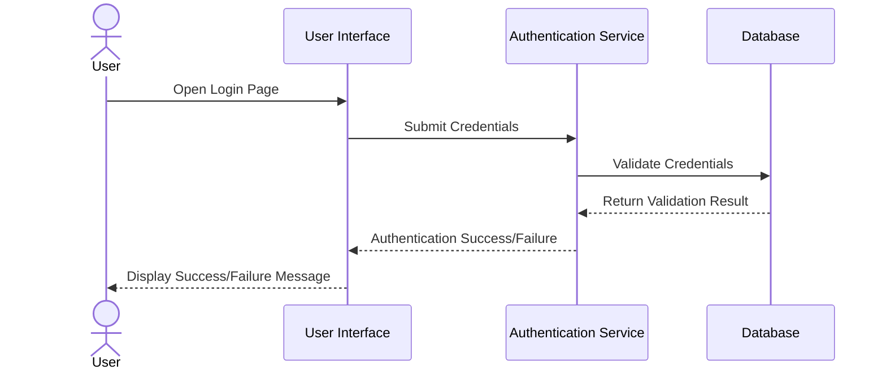
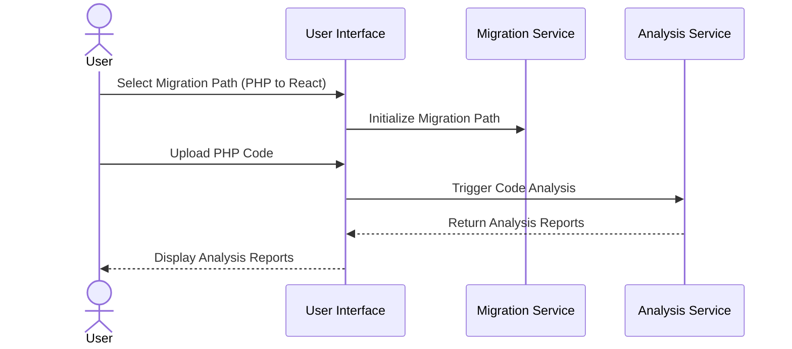
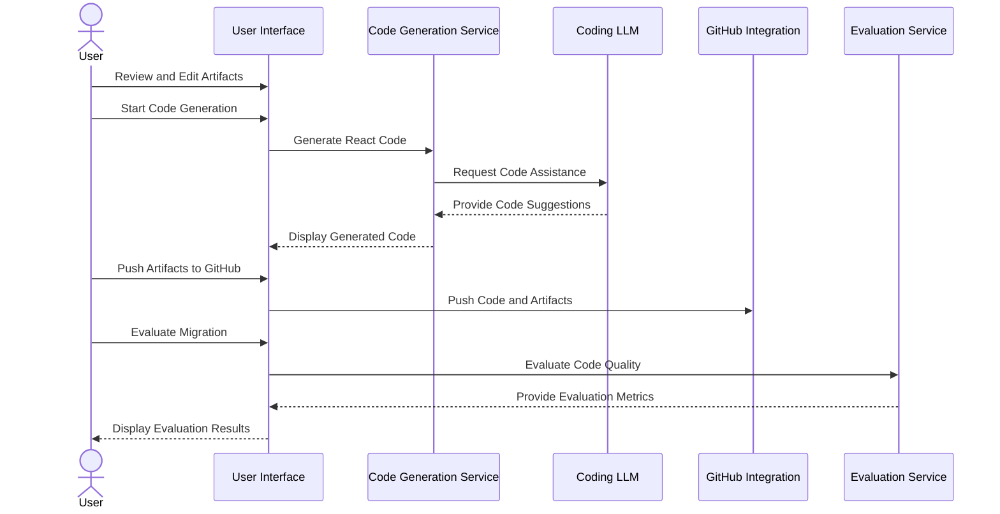

Below is a markdown file with Mermaid.js sequence diagrams showcasing three key user flows: Authentication, Migration Path Selection and Code Analysis, and Code Generation and Evaluation. These diagrams are created based on the requirements provided.

```markdown
# mAIgration MastEr Sequence Diagrams

## 1. User Authentication



## 2. Migration Path Selection and Code Analysis



## 3. Code Generation and Evaluation



These diagrams represent the core interactions and processes involved in the mAIgration MastEr project, covering authentication, migration path setup, code analysis, code generation, and evaluation. Each sequence diagram captures the key components and interactions necessary for achieving the specified requirements.