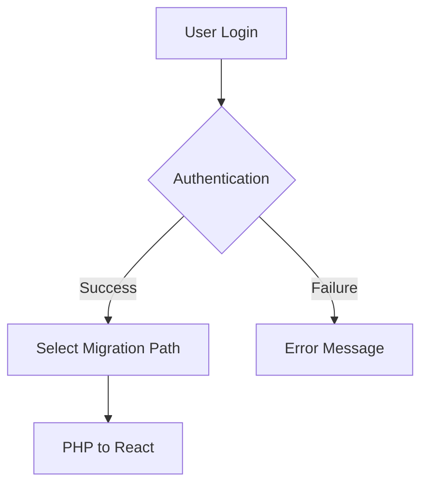
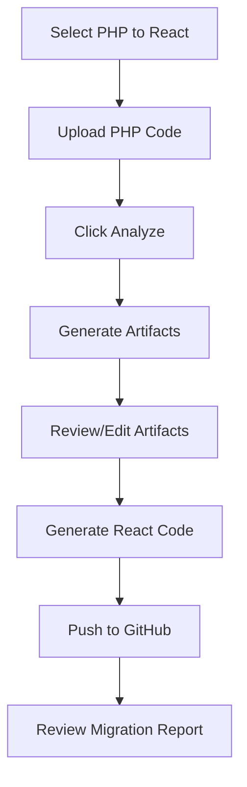
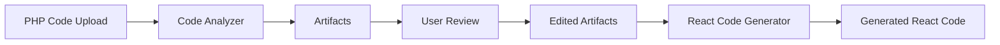

# mAIgration MastEr System Flow Documentation

## 1. User Workflows

### User Login and Migration Path Selection
1. **Login**: User logs into the system using their credentials.
2. **Select Migration Path**: User selects the migration path (currently only PHP to React).

### Migration Process
1. **Upload PHP Code**: User uploads the PHP codebase for migration.
2. **Analyze Code**: User clicks on "Analyze" to generate migration artifacts.
3. **Review and Edit Artifacts**: User reviews and edits artifacts if needed.
4. **Generate React Code**: System uses LLM to generate React code.
5. **Push to GitHub**: User pushes artifacts and code to GitHub.
6. **Review Migration Report**: User reviews the migration evaluation report.

## 2. Data Flows

### Code Upload and Analysis
- **Input**: PHP Code
- **Process**: Analyze code to generate various artifacts.
- **Output**: Artifacts such as code analysis reports, diagrams, and test cases.

### Artifact and Code Management
- **Artifacts**: Stored in a database or file storage for editing and reference.
- **Code Generation**: Use of LLMs to transform PHP code into React code.
- **GitHub Integration**: Push final artifacts and React code to a repository.

## 3. Integration Points

- **Login Module**: Connects to a user authentication service.
- **Code Analyzer**: Uses an internal engine or third-party service to analyze PHP code.
- **LLM Integration**: Connects to a coding LLM for code generation.
- **GitHub API**: Used to push artifacts and code to GitHub.
- **Evaluation Module**: May use another LLM for code evaluation and metric generation.

## 4. Error Handling

### General Error Handling
- **Authentication Failures**: Notify user with appropriate error messages and retry options.
- **File Upload Errors**: Check for file format and size constraints, provide feedback for invalid inputs.
- **Analysis Failures**: Log errors, notify users, and allow for re-attempts.
- **Code Generation Errors**: Ensure LLMs return valid outputs, use fallbacks or retries if necessary.
- **GitHub Integration Errors**: Handle connection issues, authentication failures, and provide user feedback.

### Specific Error Scenarios
- **Invalid Migration Path**: Alert user and prompt for selection of a valid path.
- **Artifact Generation Issues**: Allow users to edit manually or generate a new set of artifacts.
- **Evaluation Module Errors**: Provide detailed error logs for debugging and user notifications.

By maintaining clear error logs and user notifications, the system ensures users are always informed and can take corrective actions as needed.