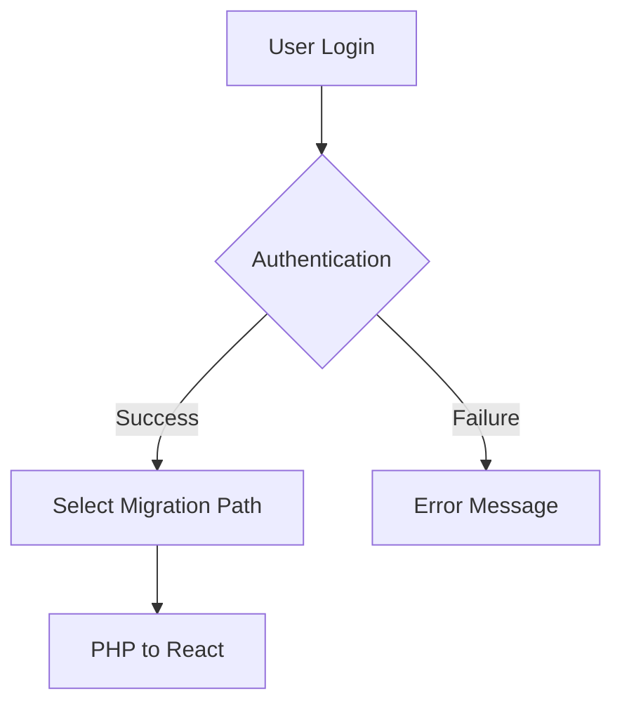

# WEB Application Development Prompt

## Application Type: Web Application
## Category: Full-Stack Development
## Template: FullStack

---

**IMPORTANT**: This is a comprehensive development prompt for building a web application. Follow ALL guidelines, standards, and precautions outlined below for optimal code quality, security, and maintainability.

## Project Description
Full stack web applicaton for code migration from one technology to another

## 🎯 Project Overview

**Description**: Full stack web applicaton for code migration from one technology to another

**Key Features to Implement**:


**Development Approach**: Follow the guidelines and standards outlined in this prompt to ensure high-quality, maintainable, and secure code.

## 📋 Project Reference Documents

> **Note for AI coding tools**: Read the full documents referenced below for complete context before implementing.

### Product Requirements Document (PRD)

# Project Requirements Document (PRD) for mAIgration MastEr

## 1. Introduction

The mAIgration MastEr is a tool designed to facilitate the migration of projects from one technology to another, commencing with the migration path from PHP to React. The tool aims to streamline the transition by providing a comprehensive suite of features including code analysis, artifact generation, and automated code rewriting using coding Language Learning Models (LLMs). Users will be able to upload their PHP co
...

📄 **Full document**: @docs/prd.md

---

### Technology Stack & Architecture

# Technology Recommendations for mAIgration MastEr Project

## 1. Frontend Technologies

### React
- **Justification**: As the project involves migrating PHP applications to React, using React for the frontend development of this tool aligns with the core functionality. React is a powerful, flexible JavaScript library for building user interfaces, particularly single-page applications, which is perfect for creating the dynamic and responsive UI needed for this project.

### Redux
...

📄 **Full document**: @docs/techstack.md

---

### Frontend Implementation Guide

# Frontend Implementation Guide for mAIgration MastEr

This guide provides a detailed frontend implementation plan for the mAIgration MastEr project, focusing on key components, state management, UI/UX guidelines, and code examples to help build the required features.

## 1. Component Structure

The following UI components will be necessary to implement the described features:

- **Login Component**
  - Handles user authentication.
  - Includes forms for username and password.

...

📄 **Full document**: @docs/frontend.md

---

### Requirements Specification

# mAIgration MastEr Requirements Document

## 1. Project Overview

The mAIgration MastEr is a specialized tool designed to facilitate the migration of projects from one technology stack to another, initially focusing on PHP to React. The tool provides an end-to-end solution for analyzing PHP code and generating the necessary artifacts for rewriting the application in React. It leverages advanced coding language models (LLMs) to assist in generating and explaining the new code, as well as evaluat
...

📄 **Full document**: @docs/requirements.md

---

### Backend Implementation Guide

# mAIgration MastEr Backend Implementation Plan

**Version:** 1.0  
**Date:** 2/7/2026  

---

## 1. Document Header

This document outlines the backend implementation plan for the mAIgration MastEr project, focusing on migrating projects from PHP to React. This plan includes API design, data models, business logic, security, performance optimization, and code examples.

## 2. API Design

### Endpoints

#### 1. User Authentication
- **POST** `/api/login`
...

📄 **Full document**: @docs/backend.md

---

### Application Flow & User Journeys

# mAIgration MastEr System Flow Documentation

## 1. User Workflows

### User Login and Migration Path Selection
1. **Login**: User logs into the system using their credentials.
2. **Select Migration Path**: User selects the migration path (currently only PHP to React).



### Migration Process
...

📄 **Full document**: @docs/flow.md

---

### Project Status & Progress

# Project Status Tracking Template: mAIgration MastEr

## 1. Implementation Phases

### Phase 1: User Authentication
- Develop Login Module
- Implement security measures for user authentication

### Phase 2: Migration Path Selection and Initial Setup
- Implement Migration Path Selection (PHP to React)
- Design and develop the Migration Path main screen for PHP to React

### Phase 3: Code Analysis and Artifact Generation
- Develop functionality to upload PHP code
...

📄 **Full document**: @docs/status.md

---

### diagram_component

Below is a markdown file with a Mermaid.js flowchart TB diagram, showcasing the system components grouped by layer (Frontend, Backend, Data, External) with their relationships based on the given project requirements.

```markdown
# mAIgration MastEr Component Diagram

```mermaid
flowchart TB
    %% Define Frontend Layer
    subgraph Frontend [Frontend Layer]
        direction TB
        A[Login Module]
        B[Migration Path Selection]
        C[PHP Code Upload]
...

📄 **Full document**: @docs/diagram_component.md

---

### diagram_sequence

Below is a markdown file with Mermaid.js sequence diagrams showcasing three key user flows: Authentication, Migration Path Selection and Code Analysis, and Code Generation and Evaluation. These diagrams are created based on the requirements provided.

```markdown
# mAIgration MastEr Sequence Diagrams

## 1. User Authentication

```mermaid
sequenceDiagram
    actor User
    participant UI as User Interface
    participant Auth as Authentication Service
    participant DB as Database

...

📄 **Full document**: @docs/diagram_sequence.md

---

### diagram_architecture

Here is a high-level system architecture diagram in Mermaid.js that addresses the requirements of the "mAIgration MastEr" project:

```markdown
```mermaid
flowchart TB
    subgraph User Interface Layer
        direction TB
        A[Login Module]
        B[Migration Path Selection]
        C[Migration Path Main Screen]
    end

    subgraph Application Logic Layer
        direction TB
        D[Code Analysis Engine]
        E[Artifact Editor]
        F[Code Generator]
...

📄 **Full document**: @docs/diagram_architecture.md

## 🏗️ Architecture Guidelines

**Pattern**:
- Full-stack monorepo or separate repos, API-first design approach, Shared type definitions, Microservices or monolithic architecture

**Description**:
- Application architecture pattern

**Structure**:
- **directories**: Full-stack monorepo or separate repos, API-first design approach, Shared type definitions, Microservices or monolithic architecture
- **files**: Client-server communication patterns, Database to API to frontend flow, Real-time updates (WebSockets, SSE), Caching strategies across layers
- **conventions**: File-based routing (Next.js style), API route organization, Protected routes and middleware, SEO-friendly routing

**Data Flow**:
- Client-server communication patterns, Database to API to frontend flow, Real-time updates (WebSockets, SSE), Caching strategies across layers

**State Management**:
- React State

**API Design**:
- RESTful

## 📋 Development Guidelines


## 📏 Coding Standards


## 📚 Required Libraries and Dependencies


## 🔒 Security Considerations


## ⚡ Performance Guidelines


## ✨ Best Practices

## 🧪 Testing Guidelines
  
  

## 🚀 Deployment Guidelines
  
  

## ⚠️ Critical Precautions


## 🛠️ Implementation Instructions

Build a responsive web application with modern frontend framework. Ensure cross-browser compatibility and accessibility.

### Development Workflow
1. **Setup**: Initialize project with proper structure and dependencies
2. **Core Implementation**: Build core functionality following architecture guidelines
3. **Security**: Implement security measures as outlined above
4. **Testing**: Write comprehensive tests for all components
5. **Performance**: Optimize based on performance guidelines
6. **Documentation**: Document all APIs, components, and deployment procedures
7. **Deployment**: Follow deployment guidelines for chosen platform

### Quality Checklist
- [ ] All security requirements implemented
- [ ] Performance optimizations applied
- [ ] Comprehensive test coverage achieved
- [ ] Code follows all coding standards
- [ ] Documentation is complete and accurate
- [ ] Deployment configuration is ready

---

## 📚 Final Notes

**Remember**: This prompt contains comprehensive guidelines for building a high-quality application. Prioritize security, performance, and maintainability throughout the development process.

**Code Quality**: Follow all coding standards and best practices outlined above.
**Security First**: Never compromise on security requirements.
**Performance**: Optimize early and measure continuously.
**Testing**: Maintain high test coverage and quality.

**Good luck with your development!** 🚀